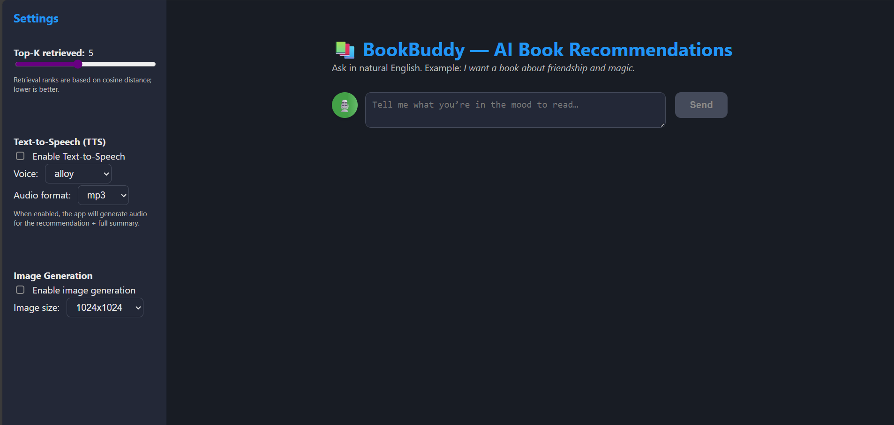
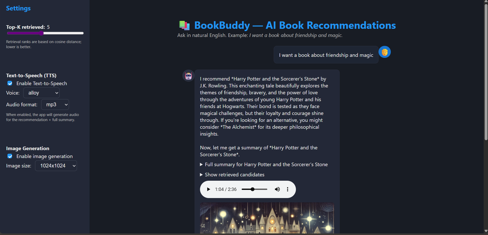

# SmartLibrarian

SmartLibrarian is an AI-powered book assistant that provides book recommendations, summaries, and more using advanced retrieval-augmented generation (RAG) techniques. It supports both a Streamlit-based all-in-one UI and a modern React frontend with a FastAPI backend.

---

## Features
- **Conversational Book Recommendations**: Get personalized book suggestions based on your interests.
- **Full Book Summaries**: Access detailed summaries for each recommended book.
- **Voice Mode**: Use your microphone to interact with the assistant (speech-to-text and text-to-speech support).
- **Image Generation**: Generate illustrative book covers for recommendations.
- **Modern UI**: Choose between a simple Streamlit app or a feature-rich React frontend.

---




## 1. Using Streamlit (All-in-one UI)

### Prerequisites
- Python 3.10+
- `pip`

### Setup & Run
1. Clone the repository:
   ```bash
   git clone https://github.com/Andreii1414/SmartLibrarian
   cd SmartLibrarian
   ```
2. Install dependencies:
   ```bash
   pip install -r requirements.txt
   ```
3. Set up your `.env` file (see below for an example).
4. Ingest or update book summaries into the vector database (required before starting the app):
   ```bash
   python src/ingest.py --file data/book_summaries.json
   ```
5. Start the Streamlit app:
   ```bash
   streamlit run src/streamlit_app.py
   ```
6. Open the provided local URL in your browser.

---

## 2. Using React Frontend + FastAPI Backend

### Prerequisites
- Python 3.10+
- Node.js 18+
- `pip` and `npm`

### Backend (FastAPI)
1. Install Python dependencies:
   ```bash
   pip install -r requirements.txt
   ```
2. Set up your `.env` file (see below for an example).
3. Ingest or update book summaries into the vector database (required before starting the backend):
   ```bash
   python src/ingest.py --file data/book_summaries.json
   ```
4. Go to the backend directory:
   ```bash
   cd src
   ```
5. Start the FastAPI backend:
   ```bash
   uvicorn fast_api:app --reload
   ```

### Frontend (React)
1. Go to the frontend directory (using a new terminal):
   ```bash
   cd bookbuddy-frontend
   ```
2. Install dependencies:
   ```bash
   npm install
   ```
3. Start the React app:
   ```bash
   npm start
   ```
4. The app will open in your browser (usually at http://localhost:3000).

---

## .env Example
```
OPENAI_API_KEY=your_openai_api_key
CHROMA_PERSIST_DIRECTORY="path\\to\\SmartLibrarian\\.chroma"
CHROMA_COLLECTION_NAME="book_summaries"
EMBEDDING_MODEL="text-embedding-3-small"
CHAT_MODEL="gpt-4o-mini"
BOOK_JSON_PATH="path\\to\\SmartLibrarian\\data\\book_summaries.json"
TTS_MODEL="gpt-4o-mini-tts"
TTS_VOICE="alloy"
TTS_FORMAT="mp3"
STT_MODEL="whisper-1"
STT_LANGUAGE="en"
```

---

## Project Structure

### Root
- `README.md` — Project documentation and setup instructions
- `requirements.txt` — Python dependencies
- `data/book_summaries.json` — Book summaries in JSON format (see below)

### src/ (Python backend)
- `fast_api.py` — FastAPI backend serving the REST API for book recommendations, TTS, image generation, and transcription
- `streamlit_app.py` — Streamlit-based all-in-one UI for book recommendations
- `ingest.py` — Script to ingest book summaries into the Chroma vector database using OpenAI embeddings
- `rag_core.py` — Core logic for retrieval-augmented generation (RAG): embedding, retrieval, and recommendation logic
- `moderation.py` — OpenAI moderation API wrapper to filter inappropriate prompts
- `tts.py` — Text-to-speech (TTS) utility using OpenAI's API
- `image_gen.py` — Book cover image generation using OpenAI's DALL-E API

### bookbuddy-frontend/ (React frontend)
- `src/App.js` — Main React component, chat UI, handles user input, settings, and API calls
- `src/App.css` — Main CSS for layout, theming, and responsive design
- `package.json` — Frontend dependencies and scripts

### JSON Data Structure
- `data/book_summaries.json` is an array of objects, each with:
  - `title` (string): Book title
  - `summary` (string): Full summary of the book

Example:
```json
[
  {
    "title": "1984",
    "summary": "George Orwell’s *1984* offers one of the most chilling visions of a totalitarian future..."
  },
  {
    "title": "The Hobbit",
    "summary": "J.R.R. Tolkien’s *The Hobbit* is a tale of adventure, growth, and courage..."
  }
]
```

---

## Notes
- Before running either UI, you must ingest the book summaries into the vector database.
- The React frontend communicates with the FastAPI backend at `http://localhost:8000` by default.
- Both UIs support voice and image features if enabled in the settings.

---